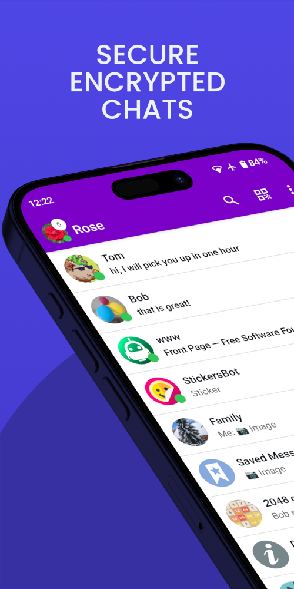
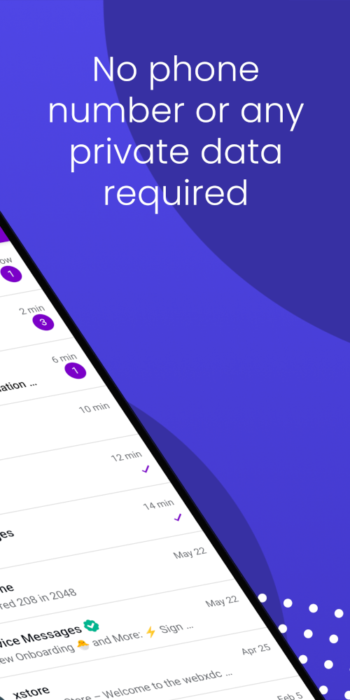

## ArcaneChat Android Client

A [Delta Chat](https://delta.chat/) client for Android. Learn more at: https://arcanechat.me

 

# ArcaneChat vs Delta Chat

Main differences with Delta Chat client:

* Support for having multiple mini-apps open at the same time
* You can keep reading and navigating the chats while you have a mini-app open
* Support for some markdown styles in text messages (bold, italic, strike, etc.)
* Support for displaying Telegram's animated stickers (.tgs files)
* Support for SVG images previews
* Multiple color themes/skins
* It is possible to disable profiles to completely disconnect them saving data/bandwidth
* Clicking on a message with a POI location, will open the POI on the map
* Last-seen status of contacts is shown in your contact list, like in WhatsApp, Telegram, etc.
* Videos are played in loop, useful for short GIF videos
* Verified icon is shown in the chat list for the "Device Messages" and "Saved Messages" chat to avoid fishing attempts by someone pretending to be the official chats
* Voice messages have more aggressive compression in "worse quality" mode to save data plan
* Automatic download of messages limited to 640KB by default
* Profile's display name is always shown in the app's title bar instead of the name of the app
* Better settings organization with additional "Privacy" section

## WebXDC

ArcaneChat has some extended support for WebXDC (in-chat mini-apps):

- `window.webxdc.arcanechat` a string with the ArcaneChat version and can be used by app developers
  to detect when they can use the ArcaneChat-specific features.
- `sendToChat()`: extra property `subject` can be set to a text string to set message/email's subject.
- `sendToChat()`: extra property `html` can be set to a string of html markup to set the HTML part of the email/message.
- `sendToChat()`: the file object parameter also accepts a `type` field that can be one of:
  * `"sticker"`
  * `"image"`
  * `"audio"`
  * `"video"`
  * `"file"` (default if `type` field is not present)

# Contributing

AI tools must not be used to submit AI-generated code or content without review or understanding.
All pull requests descriptions and code comments must be human-generated.
AI-generated pull requests will be closed without a notice.

# Credits

ArcaneChat is based on the [official Delta Chat client](https://github.com/deltachat/deltachat-android) with several improvements.

ArcaneChat uses a [modified](https://github.com/ArcaneChat/core) version of the [Chatmail Core Library](https://github.com/chatmail/core).
